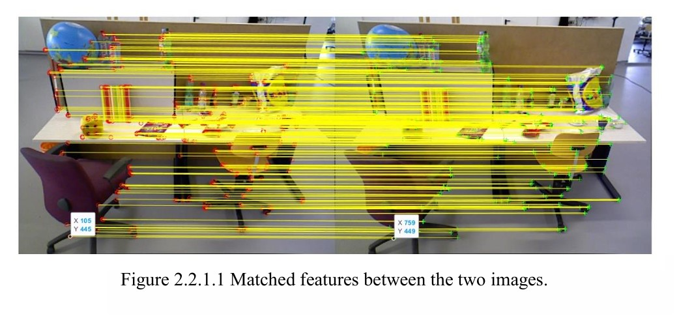
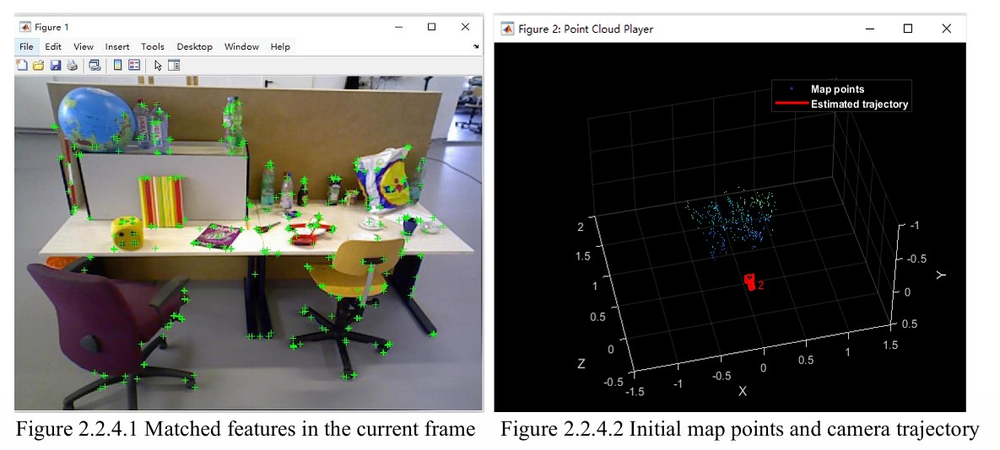
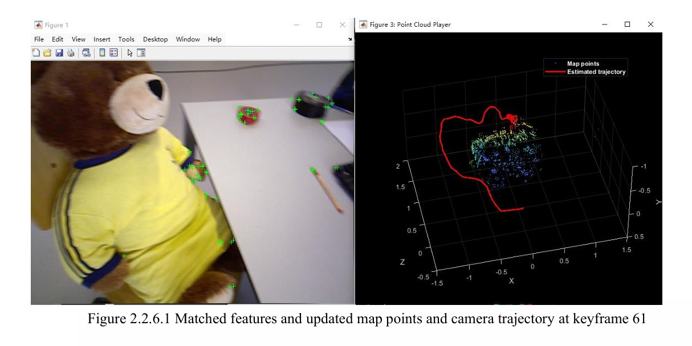
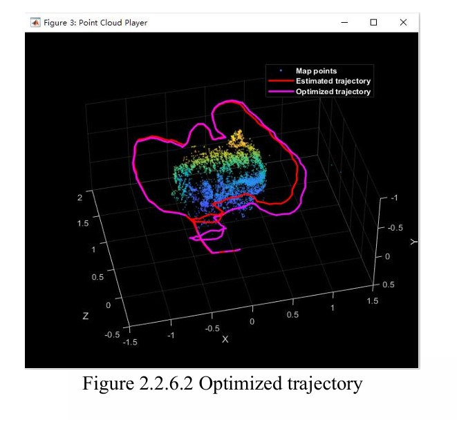
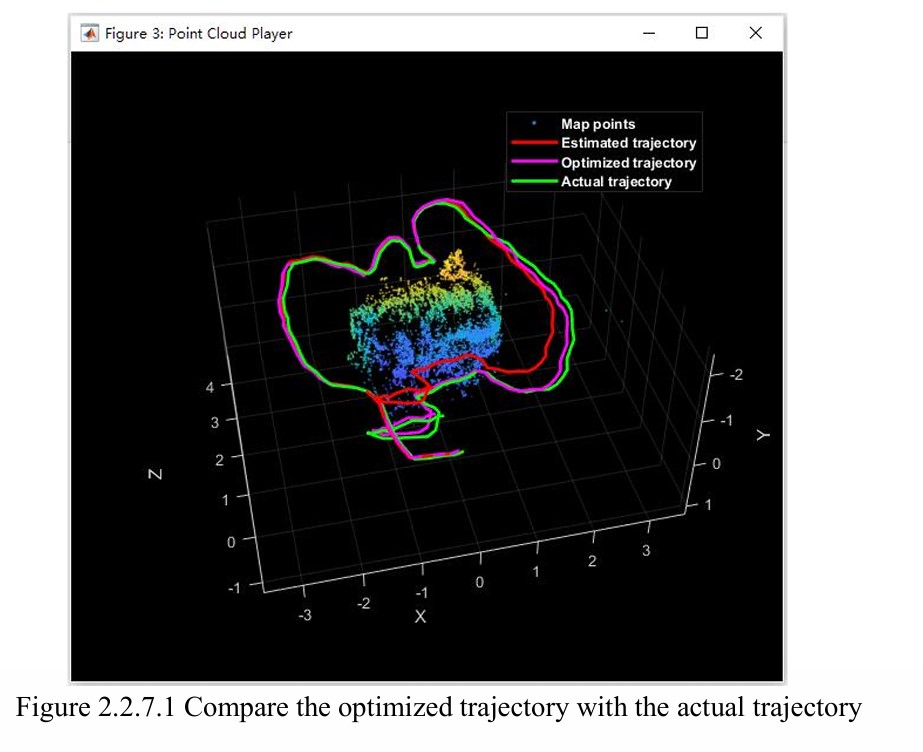
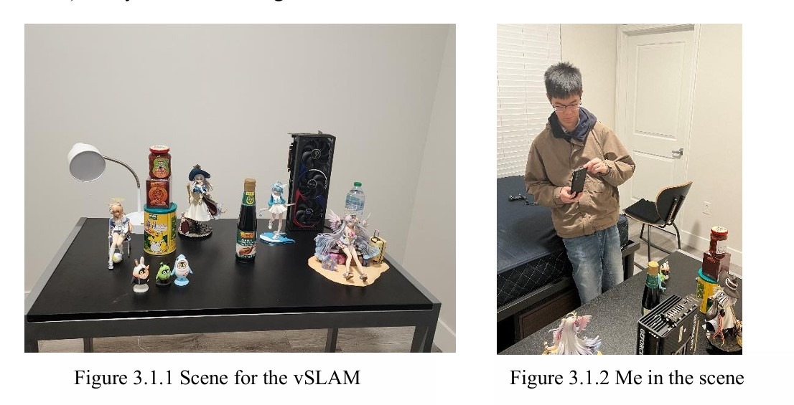
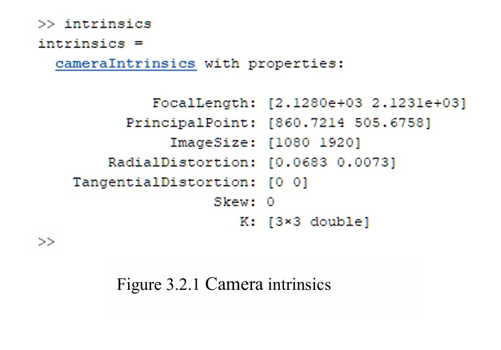
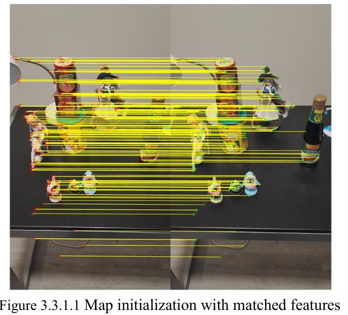
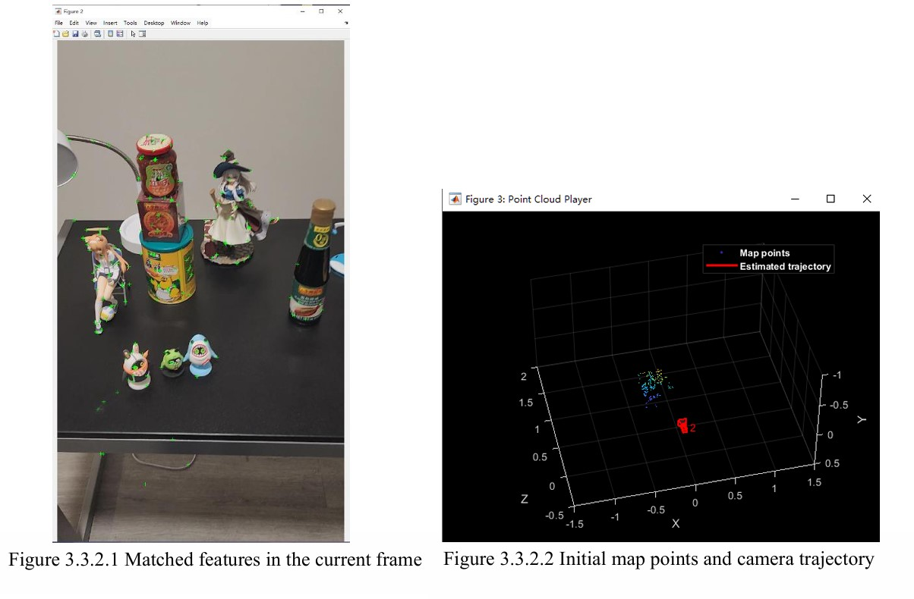

# Visual-SLAM with MATLAB – ME462 Robotic Vision Project

**Name**: Yuchen Xia  
**Date**: April 30, 2025  
**Course**: ME462 Robotic Vision

---

## 1. Introduction
Visual Simultaneous Localization and Mapping (visual-SLAM) is a technique that enables a moving camera to estimate its own trajectory and build a map of the surrounding environment using only visual input. It plays an essential role in fields such as robotics and autonomous navigation. This project is based on the official MATLAB example provided by MathWorks [1], which presents a modular vSLAM system including feature detection, pose estimation and map construction. To better understand the implementation, example code was studied first in detail and then extended it by using customized data. By recording a short video and extracting frames through MATLAB, vSLAM was applied with a customized image sequence. This report summarizes both the steps of the original implementation, and the modifications required to make it work with my own dataset.

---

## 2. Implement visual-SLAM example code 
This part summarizes MATLAB example code about Visual-SLAM. The process contains a series of steps, like image preprocessing, feature extraction and matching, pose estimation, map point triangulation, keyframe selection, bundle adjustment, loop closure detection, and visualization. Each step plays an important role in reconstructing the camera's 3D position and orientation. The following summarizes the main steps of how their Visual-SLAM is implemented.

###	Initialization and Image Loading 
-Prepare input image sequence and camera parameters for processing.

### Map Initialization
-Estimate the initial camera motion and triangulate the first 3D map points.

###	Store Key Frames and Map Points
-Save the initial key frames and map points into structured datasets.

###	Place Recognition Database Setup
-Create a visual vocabulary using bag-of-words for future loop detection.

###	Initial Map Refinement
-Apply bundle adjustment to optimize the initial reconstruction.

###	Tracking
-Track camera motion frame by frame and decide when to insert new key frames.

### Local Mapping
-Expand and refine the map by triangulating new points and adjusting nearby poses.

###	Loop Closure 
-Detect and correct drift by recognizing revisited places and updating the global map.

###	Evaluation with Ground Truth
-Compare the estimated trajectory with ground truth data to assess system accuracy.

## 2.2.1 Map initialization
After Downloading Input Image database, map initialization is a crucial step, where the initial 3D map is constructed using two frames. After extracting and matching ORB features, the system estimates the relative camera pose using either a homography (for planar scenes) or a fundamental matrix (for general 3D scenes), depending on which model yields a lower reprojection error. The relative pose is then used to triangulate 3D points from the matched features. As shown in the Afigure 2.2.1.1

  

## 2.2.2 Store initial key frames and map points
After the initial map is created from two frames, the key frames and corresponding 3D map points are stored using structured data containers. The “imageviewset” object is used in this step to store key frame attributes such as feature points, ORB descriptors, and camera poses. It also tracks connections between key frames through feature correspondences. Meanwhile, the “worldpointset” object records the 3D coordinates of map points and their 2D projections in each key frame. 

## 2.2.3 Initialize place recognition database
To enable loop closure detection, a visual vocabulary is built using a bag-of-words approach. The “bagOfFeaturesDBoW” object is created from a large set of training images by extracting and clustering ORB descriptors. This database allows the system to recognize previously visited locations by comparing new images to stored visual words.

## 2.2.4 Refine and visualize the initial reconstruction

This step first optimizes both camera poses and world points to minimize the overall reprojection errors as shown in the figure 2.2.4.1. After refinement, the attributes of each map point like its position, viewing direction, and observable depth range are updated. Then the map points and the camera locations are visualized, As shown in the figure 2.2.4.2.

  

## 2.2.5 Tracking
In this step, the system follows the camera movement by comparing each new frame with the previous key frame. It matches visual features, estimates the camera's position, and decides whether to save the current frame as a new key frame. If too few features are matched, new key frames are added more often to avoid losing track.

## 2.2.6 Local mapping and loop closure
After a new key frame is added, local mapping is performed to expand and refine the map. New 3D points are created by triangulating unmatched features between the current and nearby key frames. Meanwhile, Loop closure detection runs periodically to check if the system has returned to a previously visited location. If a valid loop is detected, the system estimates the relative transformation between the current and past frame and updates the map and key frame connections. As shown in the figure 2.2.6.1.

  

After the main loop, perform optimization to correct the drift of camera poses and update the 3-D locations of the map points using the optimized poses and the associated scales. As shown in the figure 2.2.6.2.

  

## 2.2.7 Compare with the ground truth
In the final step, the estimated camera trajectory is compared with ground truth data to evaluate SLAM accuracy. The ground truth poses are imported from a file using a helper function, and the actual camera path is plotted alongside the optimized trajectory. As shown in the figure 2.2.7.1.

  

## 2.3 Discussion of visual-SLAM application.
For my own implementation of the vSLAM, I plan to record a video of an indoor scene. Then, extracting images from the video at regular intervals to create a frame sequence. After generating the image sequence, I will modify parts of the MATLAB example code, mainly the image loading and camera parameter sections to make it work with my own data. This allowed me to apply the vSLAM, including feature tracking, pose estimation, mapping, and visualization, based on images from a real scene.

## 3. Implement the visual-SLAM
In this section, the process of implementing a vSLAM application based on the MATLAB example studied earlier will be described. By recording a video of a real environment, the video was then converted into a sequence of images using MATLAB, and the modified vSLAM example code is applied to this custom dataset. The implementation includes camera calibration, data preprocessing, code adaptation, and final reconstruction. The following steps explain each part of the process in detail.

## 3.1 Get the database from the scene
In order to obtain enough data, I use a smartphone to take a video with a resolution of 1920*1080 pixels and a frame rate of 30. The video is 60 seconds. After extracting the images through MATLAB, a total of 906 images were obtained as a database. The following figure 3.1.1 shows what the scene looks like, and I included a photo (figure 3.1.2) of myself when taking the video.

  

## 3.2 Get the camera's intrinsics data
In order to obtain some important parameters of the camera, such as focal length, principal point, etc. I followed the previous homework steps, took multiple checkerboard pictures, and then obtained the camera parameters through MATLAB, as shown in the following figure 3.2.1

  

## 3.3.1 Map initialization
After obtaining all the required data, modify the MATLAB example code to perform map initialization for the scene. As shown in the figure 3.3.1

  

## 3.3.2 Refine and Visualize the Initial Reconstruction
Following the same steps as in Sections 2.2.2 to 2.2.4, results are obtained as the following figure:

  

## 2. Recording Real Data
- A 60-second indoor video was recorded with a smartphone (1920×1080 @ 30fps).
- MATLAB was used to extract every 5th frame, resulting in 906 images for the dataset.

## 3. Camera Calibration
- Calibration images of a checkerboard pattern were taken.
- MATLAB’s `estimateCameraParameters` function was used to obtain intrinsic parameters for the external webcam used.

##4. Adapting the Code
- Modified image loading to work with the custom image sequence
- Replaced the default camera intrinsics with the calibrated parameters
- Removed the ground truth section as no GT data was available
- Tuned parameters to improve tracking on real images

---

## 📷 Key Results

- ✅ Initial map points triangulated successfully
- ✅ ORB features tracked across frames
- ✅ Loop closure detected and triggered global optimization
- ✅ Final trajectory visualized with purple "optimized path"

> _Real-world challenges included camera shake, lighting variation, and ensuring enough texture in the environment for feature detection._

---

## 📈 Figures

  
  

---

## ✅ Conclusion

This project demonstrates how a visual-SLAM system can be adapted to real data using MATLAB. From recording to calibration and tracking, the pipeline was tested end-to-end. Although working with real-world images presents challenges like motion blur and lighting, the overall SLAM system performed well after parameter tuning and code adaptation. This hands-on process deepened my understanding of visual localization and 3D mapping in practical scenarios.

---

## 📚 Reference

[1] MathWorks. "Monocular Visual Simultaneous Localization and Mapping."  
*MATLAB Documentation*. https://www.mathworks.com/help/vision/ug/monocular-visual-simultaneous-localization-and-mapping.html

